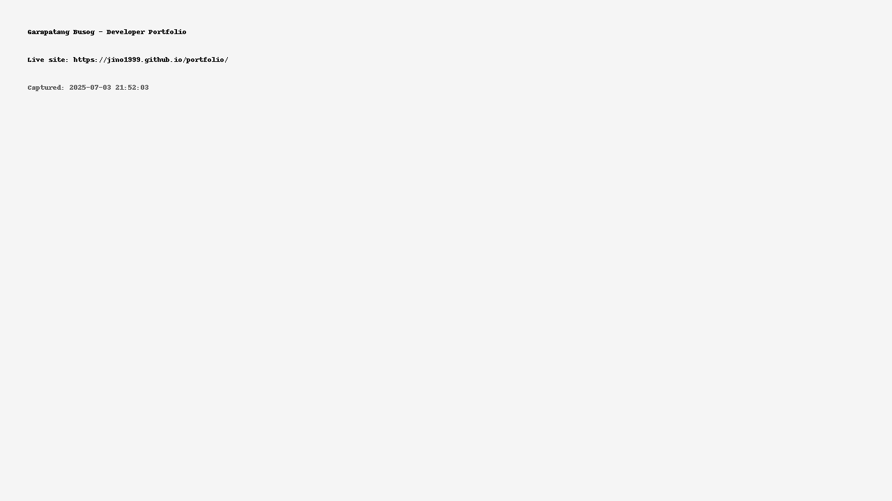

# 💼 Garapatang Busog - Developer Portfolio

Welcome to my developer portfolio!  
I’m a Front-End Developer passionate about building responsive and functional web applications using HTML, CSS, and JavaScript.

## 🌐 Live Site
🔗 [https://jino1999.github.io/portfolio](https://jino1999.github.io/portfolio)

## 📌 Featured Projects

### ✅ To-Do List with Alarm & Countdown
- Task manager with countdown timer, mute/unmute toggle, bell alarm, dark mode, drag & drop, and browser notifications.  
🔗 [Live Site](https://jino1999.github.io/todo-bell-app/)  
📂 [GitHub Repo](https://github.com/jino1999/todo-bell-app)

### 🏨 Hotel Reservation Site (Google Sheets)
- Booking form with Google Sheets integration.  
🔗 [Live Site](https://jino1999.github.io/hotel-reservation-site/)  
📂 [GitHub Repo](https://github.com/jino1999/hotel-reservation-site)

### 🌤️ Weather App
- Real-time weather using OpenWeatherMap API.  
🔗 [Live Site](https://jino1999.github.io/weather-app/)  
📂 [GitHub Repo](https://github.com/jino1999/weather-app)

### 🖼️ This Portfolio Website
- Built with HTML + CSS with animated transitions.  
📂 [GitHub Repo](https://github.com/jino1999/portfolio)

## ✉️ Contact
Email me: [jh3mskie17@gmail.com](mailto:jh3mskie17@gmail.com)
